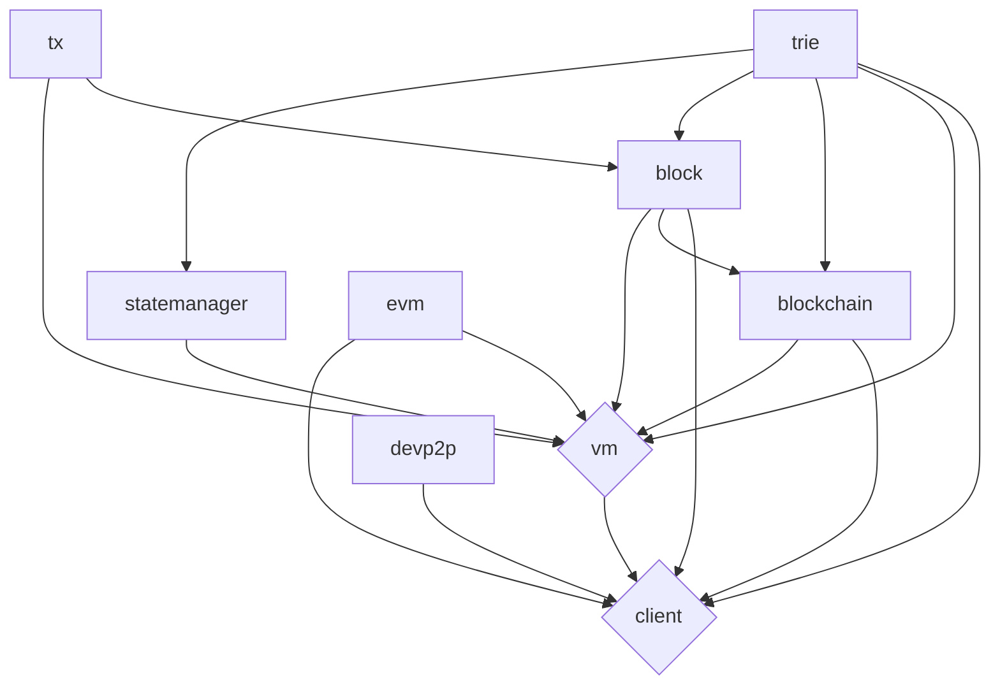

# Ethereum

Built on Javascript (not really, but let's roll with it)

---

## Show of hands if you:
---

## Show of hands if you:

- have ever written Solidity
---

## Show of hands if you:

- have ever written Solidity
- have Metamask installed (on mobile or web)
---

## Show of hands if you:

- have ever written Solidity
- have Metamask installed (on mobile or web)
- know what geth is
---

# and that they overthrew the quarians?

---

## Definitions
___
- Blockchain -- distributed ledger 
- Smart contract platform -- a distributed database with stored procedures that can be deployed and executed on-chain
- Clients/Nodes - an application that maintain a local copy of the blockchain and participate in the peer to peer network
- Wallet - an application or piece of code that maintain's a user's private key that allows them to sign transactions and interact with the blockchain
---

## Fundamental concepts
___
- History - blocks and transactions 
- State - current account balances and contract storage
- Consensus - coming to agreement on the current tip of the chain and who gets to create the next block
---

## The anatomy of an Ethereum (d)app
___
- The chain - the server
- The smart contract - the backend code (Solidity/Vyper/etc)
- The frontend - your React/Vue/Svelte/etc app
---

# Javascript in Ethereum
___
- Backend - **EthereumJS/Hardhat**/Remix/Truffle/Ganache
- Frontend - **Ethers**/Web3js
---

## Backend 
_____
#### Ethereum primitives
- Transactions - `tx` library - instructions for updating the state of the chain
- Blocks - `block` library - units of chain history
- Blockchain - `blockchain` library - the history of the chain
- Merkle-Patricia Trie - `trie` library - the current state of the chain
- VM - `vm`/`evm`/`statemanager` libraries - what runs the bytecode
- Full Node - `client` - a Javascript implementation of the Ethereum full node
---

---

### Hardhat
___
- Ethereum development environment -- built on top of EthereumJS
- Local development blockchain
- Solidity compiler - built in smart contract compiler/deployment tools
- Ethers plugin for easy smart contract testing (with types if you're into that sort of thing)
---

### Frontend -- Ethers
___
- A swiss army knife full of tools for connecting web apps to Ethereum
- Provider - a standard API for interacting with the Ethereum blockchain
  - Can use a full node or a remote service provider
- Contract - a wrapper object that simplifies interacting with smart contracts
- Utilities - formatters and conversion utilities for switching between hex, bytes, and numbers

---
## Full-stack -- Putting it all together
___
- Backend 
  - Write a smart contract
  - Deploy it on your local chain with Hardhat
  - Run tests using Mocha
- Frontend
  - Build your frontend
  - Connect it up with Ethers
  - Run it against your Hardhat local node
  
---
# The bonus
All of the above are written in **__Typescript__**

---

# Links

---

[These slides](https://ethereum-jss-lides.vercel.app/1)

---

[EthereumJS](https://https://github.com/ethereumjs/ethereumjs-monorepo/)

---

[Hardhat](https://hardhat.org)

---

[Ethers](https://ethers.org)

